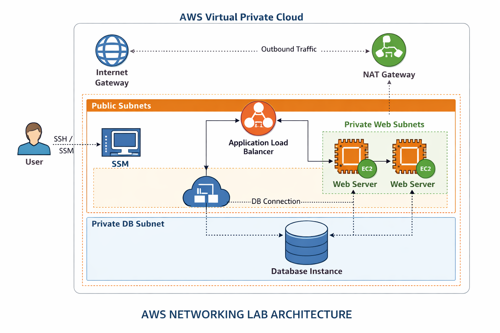
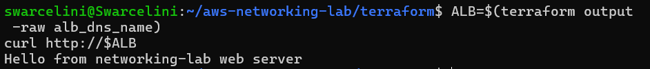

## AWS Networking Lab — VPC, Subnets, ALB, EC2, SSM
This project is a hands‑on AWS networking lab designed to demonstrate core cloud networking concepts using Terraform.
It includes a fully functional VPC architecture with public/private subnets, routing, NAT, an Application Load Balancer, and secure access via SSM Session Manager.

The goal of this lab is to validate end‑to‑end connectivity inside a custom VPC and test access to an ALB from an EC2 instance using SSM.

## Architecture Diagram


---

## Technologies Used
This project uses the following AWS services:

- VPC
- Public Subnets
- Private Subnets
- Internet Gateway
- NAT Gateway
- Route Tables & Associations
- Security Groups
- Application Load Balancer (ALB)
- EC2 Instance (for SSM testing only)
- SSM Session Manager
- IAM Roles & Instance Profiles
- Terraform (Infrastructure as Code)


## What This Lab Demonstrates:

- How to design a VPC with isolated private subnets
- How to route outbound traffic from private subnets using a NAT Gateway
- How to expose an application using an Application Load Balancer
- How to securely access an EC2 instance using SSM Session Manager (no SSH keys)
- How to test internal connectivity to the ALB from inside the VPC
- How to structure and deploy infrastructure using Terraform

## Deployment Instructions
1️⃣  Initialize Terraform
bash
terraform init
2️⃣  Validate configuration
bash
terraform validate
3️⃣  Deploy the infrastructure
bash
terraform apply -auto-approve
4️⃣  Retrieve the ALB DNS name
bash
terraform output -raw alb_dns_name
5️⃣  Test the ALB from your local machine
bash
curl http://<ALB_DNS_NAME>
## SSM Session Manager Test
Once the EC2 instance is deployed, connect using SSM:

bash
aws ssm start-session --target <instance-id>
Then test internal connectivity to the ALB:

bash
ALB=$(terraform output -raw alb_dns_name)
curl http://$ALB
Expected output:

Hello from networking-lab web server

## SSM Session Screenshot
This screenshot shows the successful SSM session and ALB connectivity test:




## Project Structure

```
aws-networking-lab/
│
├── terraform/
│   ├── main.tf
│   ├── variables.tf
│   ├── outputs.tf
│   └── ...
│
├── diagrams/
│   └── Networking-lab-diagram.png
│
├── screenshots/
│   └── Networking lab - SSM.png
│
└── README.md
```
## What I Learned
- How to design and deploy a custom VPC
- How public and private subnets interact
- How NAT Gateway enables outbound internet access
- How ALB routes traffic to targets
- How to use SSM Session Manager for secure access
- How to troubleshoot routing and connectivity
- How to structure Terraform for networking projects
